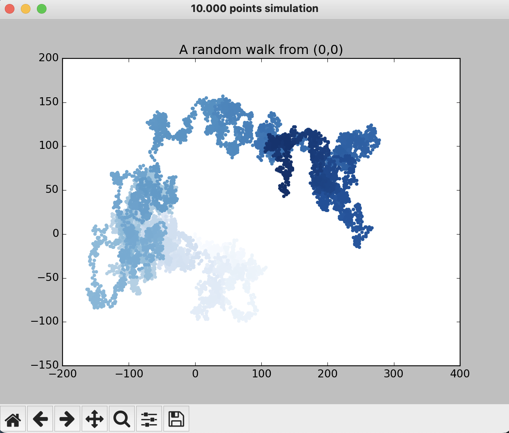
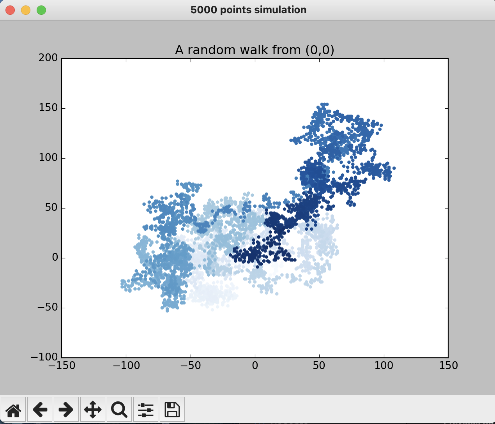

# Let's take a random walk !

In the terminal, run : ```python3 rw_visual.py``` and juste keep going as long as you want !

## Settings 
Default settings are : 
  - Steps lengths (for x and y) are the same (from 0 to 4)
  - 10.000 points for the simulation
  - The color indicates the position of the point along the walk (it varies from light to dark blue along a gradient)
Feel free to modify these in ```random_walk.py``` !


## Experience 

With default settings, we find this type of random walk : 

<div align="center">  </div>
<div align="center">  Random Walk with 10.000 points and equal steps length </div>


<br /> 


If we change to only 5.000 points, this is what we get : 

<div align="center">  </div>
<div align="center">  Random Walk with 5.000 points and equal steps length </div>

